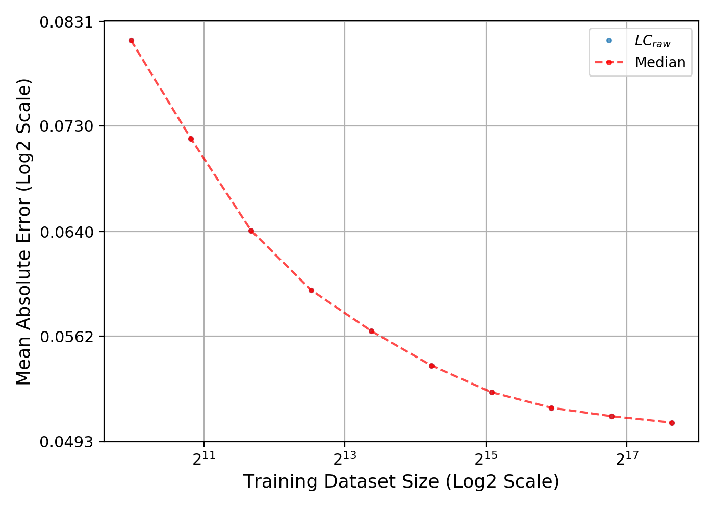
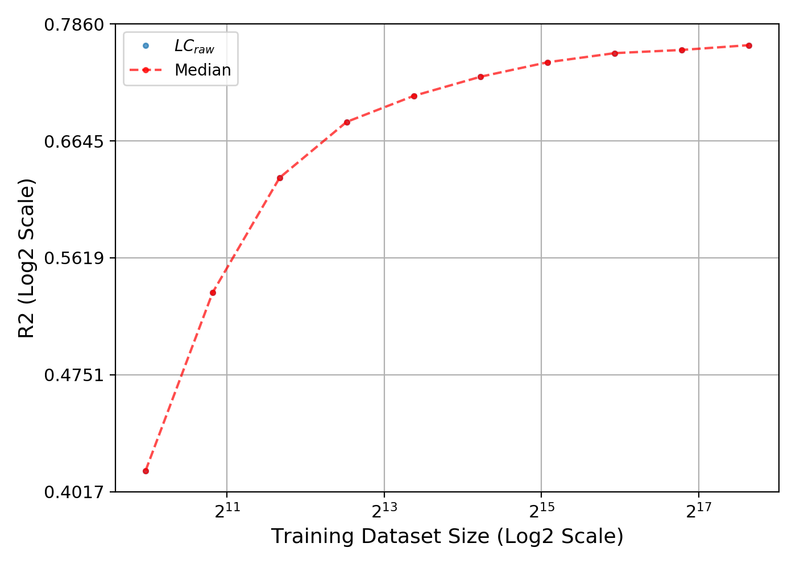
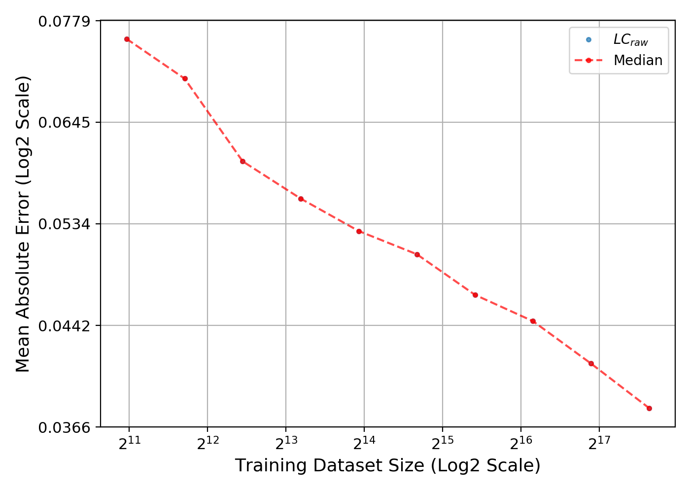
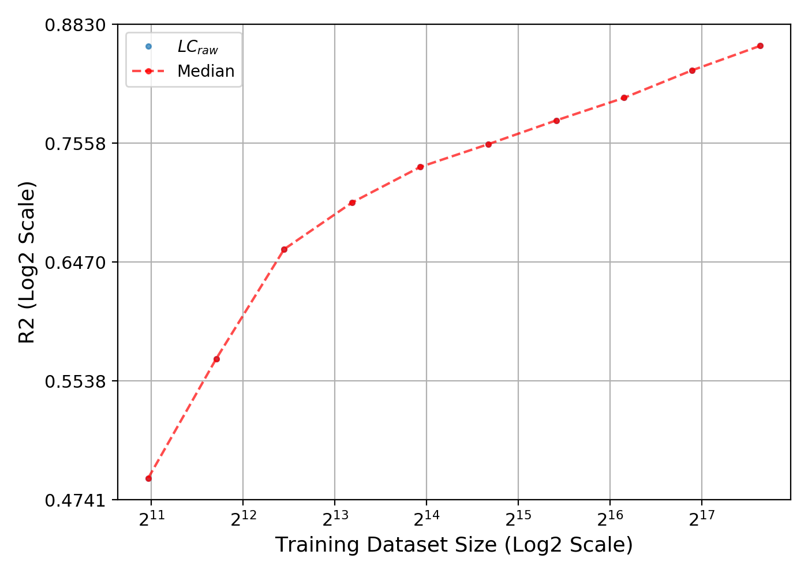

### Description of the Learning Curve Algorithm
A dataset is split into training, validation, and test. A model is trained on subsets of the training set, in order by size of the subset, from smallest to largest. In contrast, the model uses the same validation and test sets irrespective of the training set size. In order to support early stopping, the training is terminated if the generalization performance on the validation set has not improved over a predefined number of training iterations. Upon training completion, the model makes predictions based on the data. (The provided models predict the response for each cell-drug pair in the test set.) The aggregated performance scores describe how accurate the model’s predictions are. These scores are then plotted as a function of the training set size.


### Expected Outcomes
* Raw learning curve data (LCraw) - CSV file that contains the prediction scores for each subset of training samples
* Learning curves generated from LCraw - LCraw are then used to generate images of the learning curve plots 


### Setup
To set up the Python environment needed to generate learning curves:
1. Install [conda](https://docs.conda.io/en/latest/) package manager.
2. Clone this repository.
3. Create the environment as shown below.

```bash
   conda env create -f environment.yml -n lrn_crv
   conda activate lrn_crv
```

Download data that is required to build a tabular dataset. The tabular dataset is then used to train the models and generate learning curves.
1. Create an account on the Model and Data Clearinghouse ([MoDaC](https://modac.cancer.gov)). 
2. Run the script [./src/utils/download_data.py](./utils/download_data.py). This script downloads from MoDaC the following data (originally from the Cancer Therapeutics Response Portal, CTRP): 
   * Drug descriptors
   * RNA-Seq expressions
   * Drug responses  
4. When prompted by the training and test scripts, enter your MoDaC credentials.


### Generate the Tabular Machine Learning Dataset
After downloading the data from MoDaC, run the following script to create the machine learning ready DataFrame:
```bash
./scripts/gen_dfs_new.bash
```

#### Description of the Data
The script generates the following path:
`./data/ml.dfs/July2020/data.ctrp.dd.ge/data.ctrp.dd.ge.parquet`

In this path, the drug response DataFrame contains tabular data for training models and generating learning curves: 
* The DataFrame contains 254,566 of unique cell-drug pairs (samples, rows) and 2,815 columns (including RNA-Seq and drug descriptors, and metadata).
* There are 812 unique cell lines and 495 unique drugs (note that not all cell-drug combinations were screened)
* RNA-Seq: 976 features (genes)
* Mordred drug descriptors: 1,825 features (descriptors)
 

### Train Models and Generate Learning Curves
To train LightGBM regressor model and generate learning curves, run the following script:
```bash
./scripts/lc_lgb.bash ctrp
```

To train neural network regressor model and generate learning curves, run the following script:
```bash
./scripts/lc_keras.bash ctrp
```

#### Example Output
Here are the learning curves generated by training a LightGBM drug response regressor model with CTRP:
 

Here are the learning curves generated by training a neural network drug response regressor model with CTRP:
 
